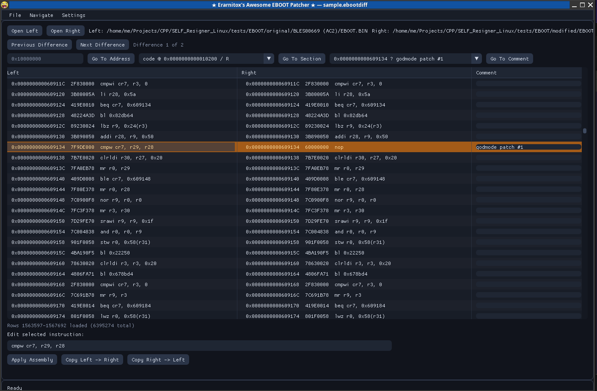
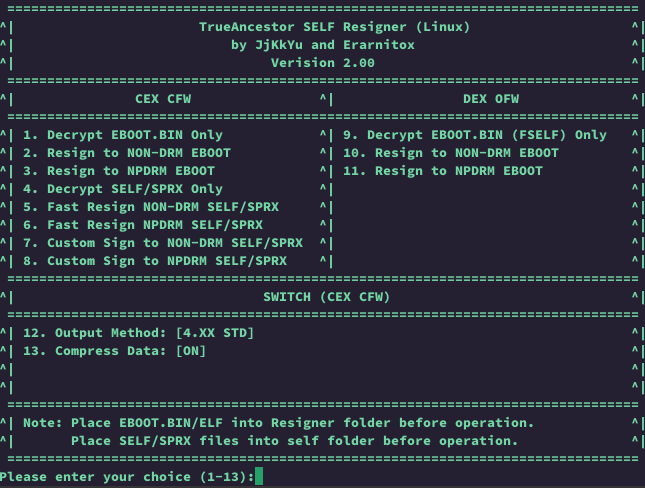

# EBOOT.BIN Patcher
A tool to easily compare and patch EBOOT.BIN and EBOOT.ELF files



### PS3 - SELF RESIGNER (ported to Linux)
This repository also still contains the SELF resigner



---

## Download

Prebuilt releases are available on the [GitHub Releases](https://github.com/Erarnitox/SELF_Resigner_Linux/releases) page.

Download the ZIP for your platform:

- **Linux:** `ps3_tools-<version>-linux-x86_64.zip`
- **Windows:** `ps3_tools-<version>-windows-x86_64.zip`

## Installation

1. Download and extract the ZIP to a folder of your choice
2. Keep the folder structure intact — `resigner`, `eboot_diff`, and `data/` must stay together
3. **Linux only:** if needed, make the binaries executable:
   ```bash
   chmod +x resigner eboot_diff
   ```

No system-wide install or admin rights required

## Usage

Run commands from inside the extracted folder so the bundled `data/` directory is found.

**EBOOT Patcher (GUI)**

```bash
# Linux
./eboot_diff

# Windows (from extracted folder)
eboot_diff.exe
```

**SELF Resigner (CLI)**

```bash
# Linux
./resigner

# Windows (from extracted folder)
resigner.exe
```

- **eboot_diff** — compare and patch EBOOT.BIN / EBOOT.ELF files
- **resigner** — resign PS3 SELF/SPRX files (use the in-app menu; place files in `self/`, `raps/`, etc.)

---

In case there are any questions, message me
on discord or x: 

@erarnitox

Hope you enjoy!
